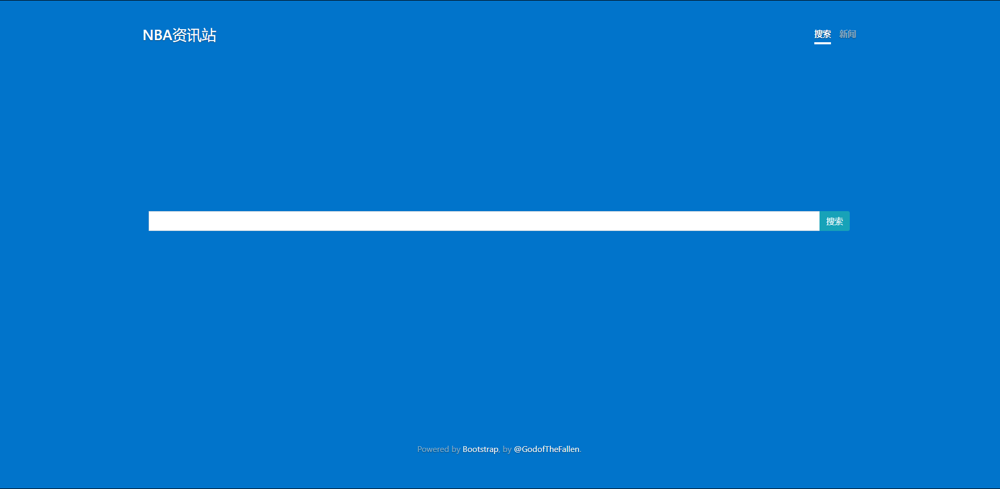
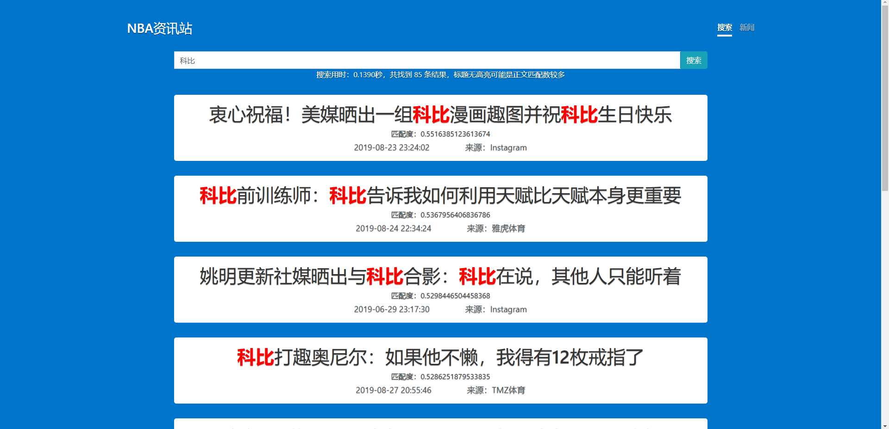
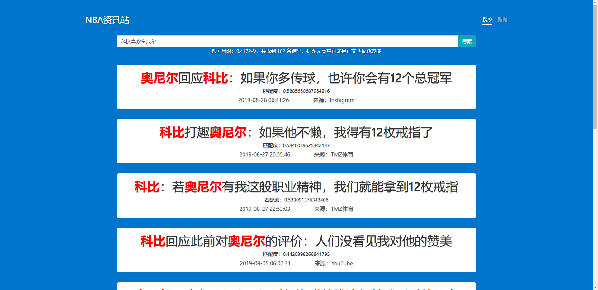
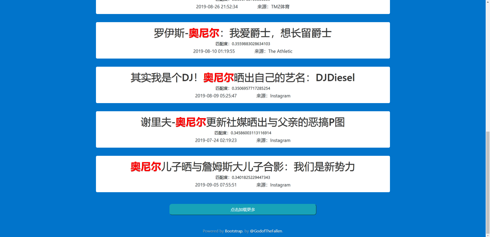
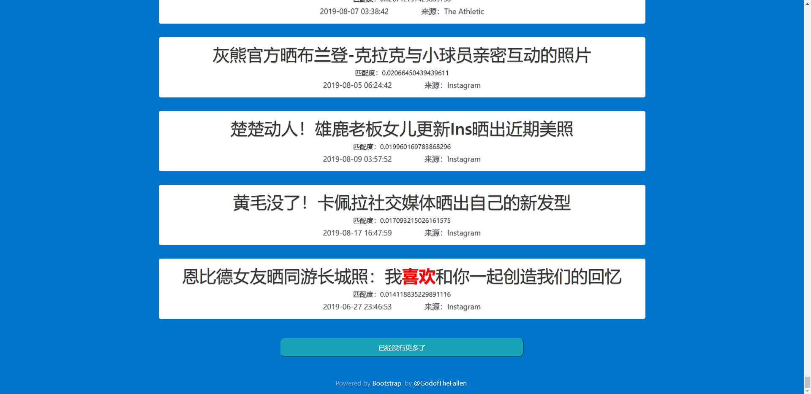
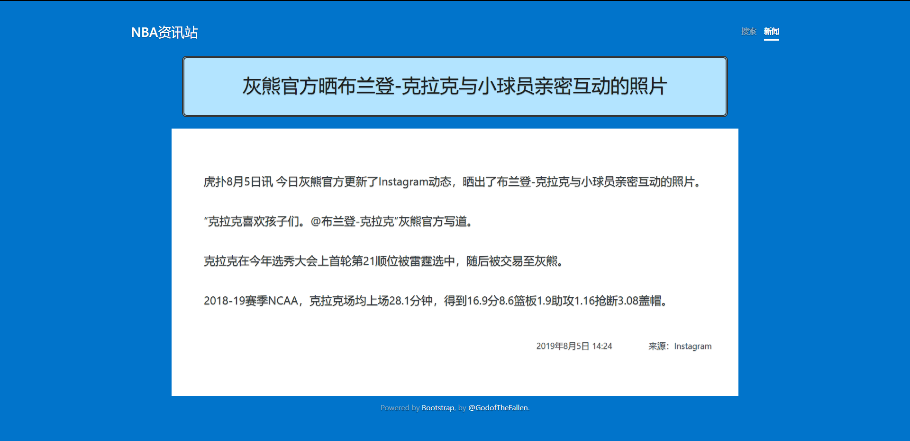
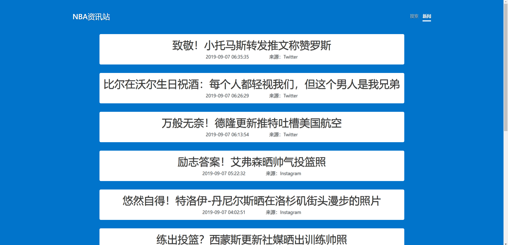

# NBA资讯站

## 功能介绍

资讯站提供了简单的咨询整合和搜索功能

### 搜索页

提供多关键词搜索功能，在搜索框内输入搜索内容（不超过40个字），点击搜索按钮即可搜索

### 结果展示

结果页会按照相关度倒序展示新闻条目，即越靠前越相关，关键词会被标红。

可以输入句子进行搜索，能够正确分词并匹配相关性最好的新闻条目。

如果搜索结果较多，将先展示前10条，可以点击页面底部的【点击加载更多】加载接下来的10条。

当所有结果加载完成后，该按钮会不可点击，其文字变为【已经没有更多了】

### 新闻详情

点击搜索结果页的新闻条目，可以进入新闻详情页面。新闻详情包含标题和正文。

### 新闻总览

点击页面右上角的【新闻】标签，可以进入新闻总览页面，该页面会按照发表时间倒序排列。同样可以点击加载更多，点击条目同样会进入详情页面。

## 网站数据

新闻总数为6000

单次搜索时间在0.3秒左右

## 算法细节

爬虫使用 `scrapy`

使用 `scrapy-djangoitem` 将爬到的新闻导入 `django` 数据库

使用 `scrapyd` 进行爬虫任务的设置，以实现动态爬取

搜索算法采用 `TF-IDF` 算法和向量空间模型

在爬下一定数量的新闻之后，会对每条新闻使用 `jieba` 进行分词，计算这些词的 `IDF` 值。

接下来对每篇文章的标题和正文分别分词，求出标题 `TF-IDF` 最大的 `5` 个词，和正文 `TF-IDF` 最大的 `20` 个词，作为标题和正文的关键字。依此建立倒排索引（关键词到相关文章的索引）。

搜索时，对搜索输入内容也进行分词，对每个词也求出 `TF-IDF` 。接着取出这些关键词下所有文章的索引，将搜索输入内容和新闻标题以及正文的 `TF-IDF` 分别看作向量（以词为维度），求出搜索向量与标题的向量的余弦值，和搜索向量与正文向量的余弦值。

按照标题余弦\*0.6+正文余弦\*0.4作为一篇新闻的匹配度（认为标题更加重要），然后按从大到小排序展示。

